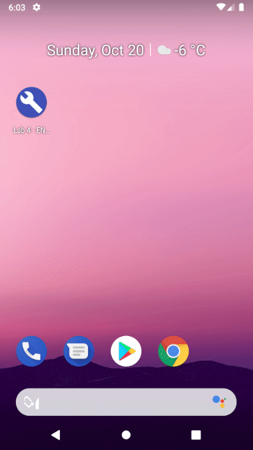

# ENSE 483 - Lab 4 - Phone & Text

## Problem Statement

- Modify [`lab3`](../lab3) source code.
  - Add ability to upload IoT sensor data using SMS to a public or private
    avaiable server.
  - Add ability to make a phone call to a number entered by the user.

## Developing

Forked from https://github.com/mitchtabian/Buttons.

Developed and built using
[Android Studio](https://developer.android.com/studio).

UI design diagram created using [Krita](https://krita.org/) and available under
[`./doc`](./doc).

> **NOTE**
>
> This application sends SMS messages to https://receive-smss.com (specifically,
> the [ID +16476605416](https://receive-smss.com/sms/16476605416/) server) by
> default. It is possible to change the value to any other phone number.
>
> The page below shows a public listing of the last 50 messages that were sent
> to this server:
>
> https://receive-smss.com/sms/16476605416/
>
> Take care when sending messages from a real phone as the phone number will be
> publicly displayed on this page. Also note that the Android Studio device
> emulator cannot send actual SMS messages.
